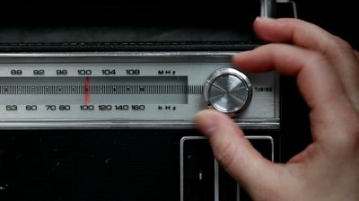

# CSC 236: Data Structures Website, Berea College

## Dr. Jan Pearce

### Berea College Fall 2026 Offering

---

## Day 6: Monday, August 31, 2026

### Day 6: In class

- Quiz on OOP
- Discuss OOP in C++
- Announce [A02: OOP Principles](https://docs.google.com/document/d/1uH5vpyvL1rCLsmI14D3LIgUo2Q-0fCCdclOz2ZAk1Eg).
- Discuss any questions on [L1: Loopy Graphics with C-Turtle](https://docs.google.com/document/d/1yMQGsJwNXTUsabYNo_k56b9-Jwk1EKFaGgM8e2fVt2c). The first milestone is due Wednesday.
- Discuss and domplete [T04: Fraction Class Understanding and Enhancement](https://docs.google.com/document/d/1NtnYd2AoMkVUivbEXej9DhO9SI1gJOD3z4ar9KneXbM/edit?tab=t.0#heading=h.c1x99npetnfu) if you did not complete it in class on Friday.

### Day 6: Outside of class

- Complete the first MIlestone of [L1: Loopy Graphics with C-Turtle](https://docs.google.com/document/d/1yMQGsJwNXTUsabYNo_k56b9-Jwk1EKFaGgM8e2fVt2c). The first Milestone is due Wednesday at Noon, **Be sure to submit a link to your repository in Moodle** - we not begin grading it until after the deadline.
- Complete [T04: Fraction Class Understanding and Enhancement](https://docs.google.com/document/d/1NtnYd2AoMkVUivbEXej9DhO9SI1gJOD3z4ar9KneXbM/edit?tab=t.0#heading=h.c1x99npetnfu) if you did not complete it in class.
- Complete  [A02: OOP Principles](https://docs.google.com/document/d/1uH5vpyvL1rCLsmI14D3LIgUo2Q-0fCCdclOz2ZAk1Eg) by Wednesday at Noon. 
- At next very earliest convenience, complete [A01: Interview with a CSC 236 TA](https://docs.google.com/document/d/1NtM4BUvfbsyYlgH63H92zRcvMYrIIYVDortntHz_nxg/edit?usp=sharing), which has been extended to Wednesday, September 9 at noon. If need be I will make a schedule, so there are not so many waiting until the last minute.

## Day 5: Friday, August 28, 2026 

### Day 5: In class

- Art show! Share your ASCII art with the class.
- Introduction of [L1: Loopy Graphics with C-Turtle](https://docs.google.com/document/d/1yMQGsJwNXTUsabYNo_k56b9-Jwk1EKFaGgM8e2fVt2c/edit?usp=sharing)
- Complete [Teamwork T03: Collaboration via Branches](https://docs.google.com/document/d/1fB24sIofHbsWZ2xJAQzCJ_RoIkfUhXZWYb0XJSjhAKQ)
- Begin [T04: Fraction Class Understanding and Enhancement](https://docs.google.com/document/d/1NtnYd2AoMkVUivbEXej9DhO9SI1gJOD3z4ar9KneXbM/edit?tab=t.0#heading=h.c1x99npetnfu) which we will complete next time.

### Day 5: Outside of class

- Read [L1: Loopy Graphics with C-Turtle](https://docs.google.com/document/d/1yMQGsJwNXTUsabYNo_k56b9-Jwk1EKFaGgM8e2fVt2c/edit?usp=sharing) and do the first milestone (due Wednesday). The final submission is due Friday.
- For Monday, in Moodle, click to add the main book **bc_cppds2_f26**, [Problem Solving with Algorithms and Data Structures using C++](https://moodle.berea.edu/mod/lti/view.php?id=844481) and then complete [R04: Read 1.5, 1.6, and 1.12-1.15 plus questions](https://moodle.berea.edu/mod/lti/view.php?id=844513). We **will** have a quiz on the reading out of this book on Monday.
- Don't forget to do [A01: Interview with a CSC 236 TA](https://docs.google.com/document/d/1NtM4BUvfbsyYlgH63H92zRcvMYrIIYVDortntHz_nxg/edit?usp=sharing) which is due Wednesday, September 2 at noon. The TAs are eager to meet you!

---

## Day 4: Wednesday, August 26, 2026

### Day 4: In class

- Possible quiz or peer instruction question on reading
- Discuss Runestone readings and quizzes and how to maximize your points. 
  - Runestone logs everything you do in Runestone, and the TAs and I can view the logs. I am sure none of you would do this but lying about what you did or when you did it will not work since the platform has been tested by tens of thousands of students for more than a decade and is very robust. 
  - You must go though the Moodle link for readings to get full credit.
  - For quizzes, you must go through the Moodle link and cannot leave the page or refresh. If you do either, you will get a zero. If you have a problem, you need to communicate in real-time. Telling me after the fact will not suffice - you need to show me the problem. 
  - Having said all this, I will be flexible with the readings in this book if you get them fully done by Friday. I will also let you redo both quizzes on Friday. I will not be flexible beyond this, so in the new book, you will need to do the readings and quizzes on time. I will not be flexible with the new book.
  - In Moodle, click to add the main book **bc_cppds2_f26**, [Problem Solving with Algorithms and Data Structures using C++](https://moodle.berea.edu/mod/lti/view.php?id=844481). We **will** have a quiz on the reading out of this book on Monday.
- Discuss [Teamwork T02:  Debugging Techniques](https://docs.google.com/document/d/1T0BS2SzKxoOXg_EpfDCpFd8UG219_Jbqzl8W1kogtcc/edit?usp=sharing). What did you learn about debuggers? Did you identify the problem in the code using the debugger?
- Questions on [L0: ASCII-Art](https://docs.google.com/document/d/14j_z0Q-HcVHP9KLok0PGk6o7U3wKpC7BN_tygccKfK8) which is due Friday. (Reminders about escaping backslashes and quotes.)
- Begin [Teamwork T03: Collaboration via Branches](https://docs.google.com/document/d/1fB24sIofHbsWZ2xJAQzCJ_RoIkfUhXZWYb0XJSjhAKQ) with a partner in class. Be sure to go slowly and carefully, and ask questions if you are unsure. This is a new skill for some of you and a new IDE for most of you.
- Work on [L0: ASCII-Art](https://docs.google.com/document/d/14j_z0Q-HcVHP9KLok0PGk6o7U3wKpC7BN_tygccKfK8).

### Day 4: Outside of class

- Complete [L0: ASCII-Art](https://docs.google.com/document/d/14j_z0Q-HcVHP9KLok0PGk6o7U3wKpC7BN_tygccKfK8). The final submission is due on Friday.
- The next textbook reading is on object-oriented programming in C++ in the main textbook for the course. It is a bit longer than the readings in the transition book, and you may find it more conceptually challenging. Again, you will need to be logged in to Moodle to get credit for the reading. The reading is on the latter part of Chapter 1 in the Runestone book **bc_cppds2_f26** and is due Monday. See [R04: Read 1.5, 1.6, and 1.12-1.15 plus questions](https://moodle.berea.edu/mod/lti/view.php?id=844513). Note that the reading is only six sections of the first chapter plus questions.
- At your convenience, do [A01: Interview with a CSC 236 TA](https://docs.google.com/document/d/1NtM4BUvfbsyYlgH63H92zRcvMYrIIYVDortntHz_nxg/edit?usp=sharing), which is due Wednesday, September 2 at Noon. The TAs are eager to meet you.

## Day 3: Monday, August 24, 2026

### Day 3: In class

- Possible quiz or peer instruction question
- Discuss any challenges with [Teamwork T01: Visual Studio, Github, and ASCII Art](https://docs.google.com/document/d/1Bz1sbwxid1ydkSHaO5nDMpMgzwa29Py6zzTlWGUvBzM)
- Discuss [L0: ASCII-Art](https://docs.google.com/document/d/14j_z0Q-HcVHP9KLok0PGk6o7U3wKpC7BN_tygccKfK8) which is due on Friday, but the first milestone is due Wednesday. (Be sure to read the hints in the lab on escaping backslashes and quotes!)
- Complete [Teamwork T02:  Debugging Techniques](https://docs.google.com/document/d/1T0BS2SzKxoOXg_EpfDCpFd8UG219_Jbqzl8W1kogtcc/edit?usp=sharing) in class today. 

### Day 3: Outside of class

- Read [Chapters 6, 7, and 8 in C++ for Python Programmers](https://moodle.berea.edu/mod/lti/view.php?id=844512) for a possible reading quiz next class. Be sure you go through Moodle and do all the exercises to get credit!
- Complete the first milestone for [L0: ASCII-Art](https://docs.google.com/document/d/14j_z0Q-HcVHP9KLok0PGk6o7U3wKpC7BN_tygccKfK8). The final submission is due on Friday.
- Fix any challenges you have had with the first two readings by going through Moodle. See your grades in Moodle and make them perfect by doing everything!
- At your convenience, do [A01: Interview with a CSC 236 TA](https://docs.google.com/document/d/1NtM4BUvfbsyYlgH63H92zRcvMYrIIYVDortntHz_nxg/edit?usp=sharing), Wednesday, September 2 at noon. The TAs are eager to meet you.

## Day 2: Friday, August 21, 2026

### Day 2: In class

- Debrief on homework and reading. Remember that I give participation points for doing the reading on-time in preparation for class, and the additional questions by noon. (If you do not currently have full credit, be sure to redo it by next time. If the future, I will not give participation credit for students are do not complete it by noon because I need to see where there were challenges. Late participation credit is not awarded.)
- Possible short quiz on reading R01.
- Debrief on installations, C++, the syllabus, and the AI policy in particular
- How did the sign-up for [Github Student Developer Pack](https://education.github.com/pack) go? Note that it might take more time to get this, so don't fret since we do not need Github Copilot and you are likely better off not using it for the first lab. You will need it for Lab L7, but there is plenty of time to get it before then - just be sure to work on it soon.
- Discuss the first lab, [L0: ASCII-Art](https://docs.google.com/document/d/14j_z0Q-HcVHP9KLok0PGk6o7U3wKpC7BN_tygccKfK8/edit?usp=sharing)
- Work to complete, then download, and submit [Teamwork T01: Visual Studio, Github, and ASCII Art](https://docs.google.com/document/d/1Bz1sbwxid1ydkSHaO5nDMpMgzwa29Py6zzTlWGUvBzM). It is due by noon on Monday.

### Day 2: Outside of class

- Be sure to complete and submit [Teamwork T01: Visual Studio, Github, and ASCII Art] by noon on Monday.
- Read [Chapters 3, 4,and 5 in C++ for Python Programmers](https://moodle.berea.edu/mod/lti/view.php?id=844511) for a potential reading quiz on Monday. Be sure to go through the Moodle link to get full credit. **Due at noon on Monday.**
- Read [L0: ASCII-Art](https://docs.google.com/document/d/14j_z0Q-HcVHP9KLok0PGk6o7U3wKpC7BN_tygccKfK8). This is an individual Lab. The first milestone is due Monday, August 26 at noon. The final completion milestone of the lab is due Friday, August 28 at noon.
- Don't procrastinate on [A01: Interview with a CSC 236 TA](https://docs.google.com/document/d/1NtM4BUvfbsyYlgH63H92zRcvMYrIIYVDortntHz_nxg/edit?usp=sharing), which is due Wednesday, September 2 at noon. You can do this at any time before then, but it is best to schedule it at your convenience rather than waiting until the last minute.

## Day 1: Wednesday, August 19, 2026

### Day 1: In class

- Welcome!
- List all of the data structures you used in Python
- What is data structures about? And what is it NOT about?
- 
- 
- Read the first part of [The Impact of AI on Computer Science Education](https://cacm.acm.org/news/the-impact-of-ai-on-computer-science-education/)
- Discussion of course: content, texts, syllabus, flow, other ideas
- Sign up for our first text: [C++ for Python Programmers](https://moodle.berea.edu/mod/lti/view.php?id=844480). Be sure to use (or make) the login from your Berea email and Berea username and then sign-up for the book *bc_cpp4py-f26*. (Note that the account you used in CSC 226 should be fine as long as the email address is your Berea College one.)
- Data structures game

**Day 1: Outside of class**: (Note: all assignments in this course are due by noon on the due date unless otherwise specified.)

- Complete [A00:Getting Started](https://docs.google.com/document/d/12iJBToSMk2A1n2mSdAmwKnFEpFVlnLz73ulsyt0htNM/edit?usp=sharing) and submit to Moodle by noon on Friday. Note that there are 6 tasks, some of which will take some time:
  1. Help us get to know you better
  2. Connect Data Structures to your career
  3. Set-up your Required IDE (this will take some time!)
  4. Read the [syllabus](https://docs.google.com/document/d/11yEERg09nUcVji8k9yzUr6asPgpxqpVKSeccP5p4wOQ/edit?usp=sharing) to understand the course structure
  5. Going through the link in Moodle, read both [Chapters 1 and 2 of C++ for Python Programmers and the course syllabus](https://moodle.berea.edu/mod/lti/view.php?id=844510) and do all activities in preparation for a potential reading quiz. **Note that if you do not go through the link to the book, not only will you not get participation points, butyou will not be able to do the activities and will not be adequately prepared for the reading quiz.**
  6. Introduce yourself to the class and the TAs on Slack

- An additional assignment has been posted with a longer deadline. See [A01: Interview with a CSC 236 TA](https://docs.google.com/document/d/1NtM4BUvfbsyYlgH63H92zRcvMYrIIYVDortntHz_nxg/edit?usp=sharing), which is due Wednesday, September 2 at noon. You can currently do this at any time before then, but I may set up a schedule if too many people procrastinate. The TAs are eager to meet you. Part of becoming a professional is learning to manage your time both effectively and efficiently. Assignments with longer deadlines like this are best to do at your earliest convenience, and part of becoming a professional is to learn to manage your own calendar. Mark your calendar for your best evening to go that is well before the deadline, so you are not held up by any procrastinators who have not yet learned to manage their calendars, and who do everything at the very last minute.

---

###### Copyright © 2026 | Licensed under a Creative Commons Attribution-Share Alike 3.0 United States License
